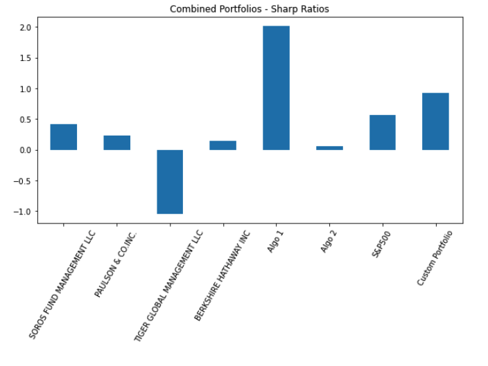
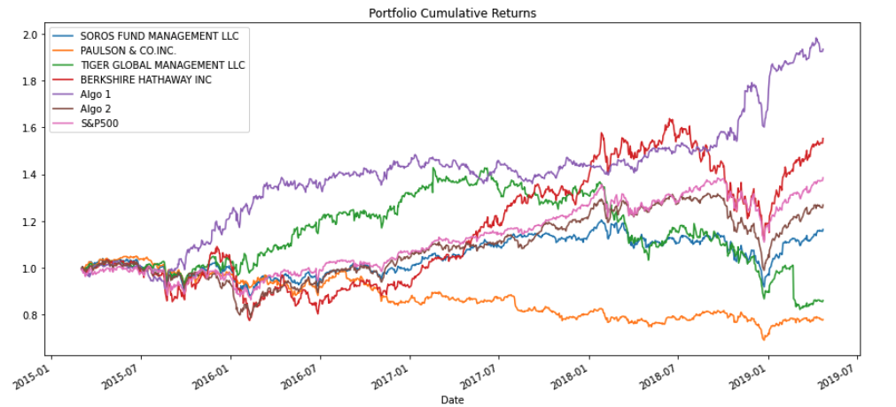

# Portfolio-Analysis (Pandas Homework)
Portfolio Analysis Consultation for Harold

## Background

I have been hired by Harold's company for consultation and determination of which portfolios are performing the best across three primary areas, volatility, returns, and risk. 

I determined I would create a tool (Jupyter Lab Notebook) and perform the required quantitative analysis techniques using Python and Pandas.
The portfolios used in this consultation are:
1. Whale Return Portfolios - consisting of large well established portfolios from the likes of Soros and Buffet
2. Algorithmic Portfolois - In-House portfolios using proprietary algorithms
3. S&P 500 Index - Idustry standard index of 500 companies
4. Custom Portfolio - Custom Portfolio of three stocks compared and analyst against the other portfolios

For this consultation, I performed the following tasks:
1. Read in and clean up dataframes
2. Join the data and conduct quantitative analysis - provide analysis
3. Create a Custom Portfolio, conduct quantitative analysis - provide analysis

### Quantitative Analysis and Summary of Results

In order to analyze and compare the portfolios against an industry benchmark, I compared the portfolios to the S&P 500 to see if any of the portfolios outperform or underperformed the benchmark index.

I calculated standard deviation (daily & annualized) of each portfolio to determine risk and volatility. I also calculated a rolling 21-day standard deviation and a 60-day rolling beta to assist in understanding which portfolios may mimick the S&P 500.

I calculated and plotted both the daily returns and cumulative returns. Below is the chart highlighting the cumulative returns for all portfolios, to include the Custom Portfolio. As presented in the chart, the Algorithmic 1 and Berkshire Hathaway portfolios outperformed the S&O 500. All other porfolios underperformed,
with respect to the S&P 500.

Another visably representative understanding of a Portfolio compared to a benchmark is using Sharpe Ratios. These ratios help determine risk versus return. As you can see, Algo 1 and the Custom Portfolio 

In summary, with respects to return, volatility and and risk (Sharpe Ratios), how did each of the porfolios, to include the Custom Portfolio, fare within each of themselves and against the industry benchmark, the S&P 500.
1. Return on investment - When looking at the cumulative return on investment, the Algo 1 portfolio performed the best followed by the Custom Portfolio and Berkshire Hathaway. All three outperforming the S&P 500 index. All other portfolios underperformed related to the S&P 500.
2. Volatility - When looking at the standard deviation of each portfolio, Algo 1, Tiger Global Management Inc. and the Custom Portfolio have greater volatility than the S&P 500 and the other portfolios. When compared to the Sharpe Ratio, the return versus risk for Algo 1 and the Custom Portfolio warrent the greater volatility, however, Tiger Global Management Inc. does not.
3. Risk (Sharp Ratios) - When considering the risk, volatility and the returns, it is evident the Algo 1 portfolio is by far on top with the Custom Portfolio a strong second. All other portfolios fall in line underperforming the benchmark S&P 500.

### Resources
1. aapl_historic.csv
2. algo_returns.csv
3. cost_history.csv
4. goog_history.csv
5. sp500_history.csv
6. whale_returns.csv

